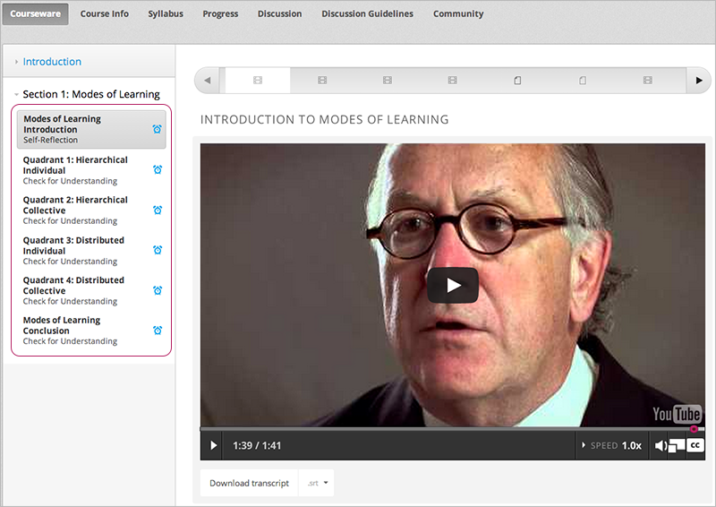

.. _Developing Course Subsections:

###################################
Developing Course Subections
###################################

To develop subsections in your course, you must first understand the
following:

* `What is a Subsection?`_
* `Viewing Subsections in the Outline`_
* `The Student View of a Subsection`_
* `Subsection States`_
* `Subsection States and Visibility to Students`_
* `Subsections and Grading`_
  
Subsection tasks:

* `Create a Subsection`_
* `Change a Subsection Name`_
* `Set the Assignment Type and Due Date for a Subsection`_
* `Set a Subsection Release Date`_
* `Hide a Subsection from Students`_
* `Reorganize Subsection`_
* `Delete a Subsection`_

****************************
What is a Subsection?
****************************

Sections are divided into subsections, which in turn contain one or more units.
A subsection may represent a topic in your course, or another organizing
principle. Subsections are sometimes called “lessons” or “learning sequences.”

***********************************
Viewing Subsections in the Outline
***********************************

TBP

*********************************
The Student View of a Subsection
*********************************

Students see subsections in the Courseware tab, listed beneath the expanded
section. In the following example, six subsections are circled, and the first
is open.

************************************************
Subsection States
************************************************

As an course author, you work with subsections in the following states:

* `Unscheduled`_
* `Scheduled with Section`_
* `Scheduled`_
* `Scheduled with Unpublished Changes`_
* `Released with Unpublished Changes`_
* `Released`_
* `Hidden from Students`_

========================
Unscheduled
========================

NOT APPLICABLE TO SUBSECTIONS?  CONFIRM REMOVE WHOLE SECTION

When you create a subsection, it does not have a scheduled release date.
Regardless of the state of units within the subsection, the entire subsection
is not visible to students.

The following example shows how an subsection in the Draft: Unscheduled state
is displayed in the outline:

TBP

To make the content available to students, you must schedule the release date.

=======================
Scheduled with Section
=======================

When you create a subsection, it is set by default to release at the same time
as the section it is in.

The following example shows how an subsection in the Scheduled with Section
state is displayed in the outline:

TBP

=======================
Scheduled
=======================

You can set a subsection to release on a date after the section releases. A
subsection that is scheduled for release on a future date is not visible to
students. Regardless of both the status of the containing section and the state
of units within the section, the entire subsection is not visible to students.

The following example shows how an subsection in the Scheduled state is
displayed in the outline:

TBP

The scheduled date must pass for the subsection to be visible to students.

==================================
Scheduled with Unpublished Changes
==================================

You can make changes to a published unit before its containing subsection
releases.  In this situation, when the release date for the subsection passes,
the last published version of units within the subsection are made available to
students. You changes are not visible to students until you publish them.

The following example shows how an subsection in the Scheduled state with
unpublished changes is displayed in the outline:

TBP

==================================
Released with Unpublished Changes
==================================

If you modify a unit within a released subsection, those modifications are not
visible to students until you publish them.

The following example shows how an subsection in the released state with
unpublished changes is displayed in the outline:

TBP

===========================
Released
===========================

A subsection that is released is visible to students; however students see only
units within the subsection that are Published.

The following example shows how an subsection in the Released state is
displayed in the outline:

===========================
Hidden from Students
===========================

A subsection that is hidden from students is not available, regardless of the
published state of any units.

The following example shows how an subsection that is hidden from students is
displayed in the outline:

TBP

************************************************
Subsection States and Visibility to Students
************************************************

Students never see a subsection that has an unscheduled or future release date.

If the release date of both the subsection and the section it is in have passed,
students see content in the subsection if it was not hidden from students. LINK
TO HIDE FROM STUDENTS TASK

For subsections that are not hidden from students and past the release date,
students can see content; however, students do not necessarily see all content
in the subsection.

Students may not see content in a unit, if it was never published, or if it is
hidden from students.

.. _Subsections and Grading:

*************************
Subsections and Grading
*************************

You set the assignment type for problems at the subsection level. This means
that all problems within the subsection are graded and weighted as a single
type.  For example, if you designate the assignment type for a subsection as
**Homework**, then all problem types in that subsection are graded as homework.

For more information, see :ref:`Establish a Grading Policy`.

.. _Create a Subsection:

****************************
Create a Subsection
****************************

To create a new subsection:

#. In the outline, expand the section in which you want to create a new
   subsection.
#. Click **New Subsection** at the bottom of the expanded section. A new
   subsection is added at the end of the section.
#. Click the Edit icon next to the new subsection name, then enter the name for
   the new subsection. Remember that students see the subsection name in the
   coursware.
#. :ref:`Add units<Create a Unit>` to the new subsection as needed.

********************************
Change a Subsection Name
********************************

To change a subsection name, click the Edit icon next to the subsection name.
The name field becomes writable. Enter the new name and tab out of the field to
save it.

.. _Set the Assignment Type and Due Date for a Subsection:

********************************************************
Set the Assignment Type and Due Date for a Subsection
********************************************************

For more information, see :ref:`Establish a Grading Policy`.

********************************
Set a Subsection Release Date
********************************

***********************************
Hide a Subsection from Students
***********************************

********************************
Reorganize Subsection
********************************

.. _Delete a Subsection:

********************************
Delete a Subsection
********************************