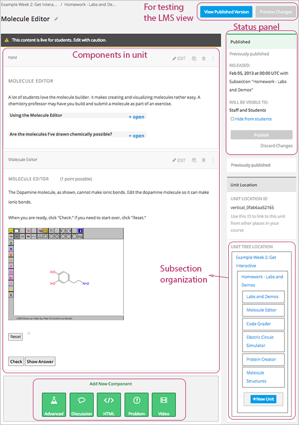
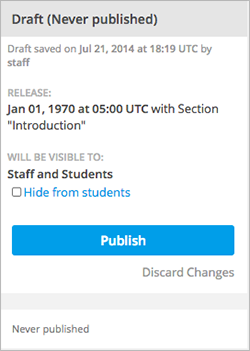
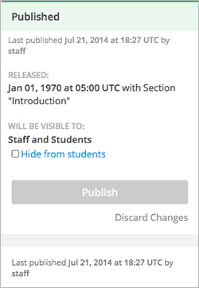
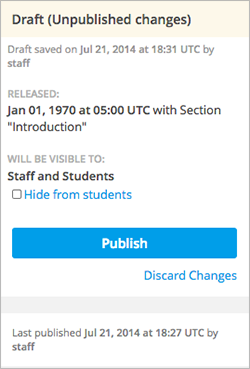
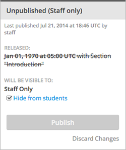
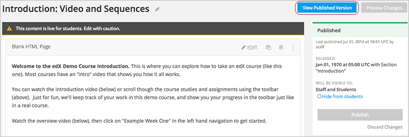
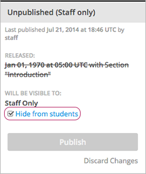

.. _Developing Course Units:

###################################
Developing Course Units
###################################

When working with units in the course outline, ensure you understand the
following:

* `What is a Unit?`_
* `Viewing Units in the Outline`_
* `Viewing the Unit Page`_
* `Viewing Units as a Student`_
* `Unit States`_
* `Unit States and Visibility to Students`_

When developing your course, you perform the following tasks with units:

* `Create a Unit`_
* `Edit a Unit`_
* `Preview a Unit`_
* `Publish a Unit`_
* `Discard Changes to a Unit`_
* `View a Published Unit`_
* `Hide a Unit from Students`_
* `Delete a Unit`_

You add content to units with :ref:`course components<Developing Course
Components>`.

.. _What is a Unit?:

****************************
What is a Unit?
****************************

A unit is a part of a :ref:`subsection<Developing Course Subsections>` that
students view as a single page.

A subsection contains one or more units.

A unit contains one or more :ref:`components<Developing Course Components>`,
such as HTML content, problems, discussions, and videos.

****************************
Viewing Units in the Outline
****************************

TBP

****************************
Viewing the Unit Page
****************************

When you click on a unit in the outline, the **Unit** page opens.

The following example shows a unit page with two components, with circles and
text to show different areas and controls in the page.

****************************
Viewing Units as a Student 
****************************

To a student using the edX Learning Management System, each unit in the
subsection appears as a link on the course ribbon at the top of the page. The
active unit is open beneath the course ribbon.

The following image shows a subsection that has seven units, which are circled
in the ribbon above the video, with the first unit open:

.. image:: ../Images/Units_LMS.png
 :alt: Image of units from the student's point of view

.. _The Unit Workflow:

************************************************
The Unit Workflow
************************************************

When you have set up the :ref:`section<Developing Course Sections>` and
:ref:`subsection<Developing Course Subsections>` in the course outline, you
work with units.

The typical workflow is:

#. :ref:`Create a new unit<Create a Unit>`.
#. :ref:`Add components to the unit<Add a Component>`.
#. :ref:`Publish the unit<Publish a Unit>`.
   
After you publish the unit, you can:

#. :ref:`Modify components in the unit<Developing Course Components>`.
#. :ref:`Publish the changes to the unit<Publish a Unit>`.
   
ADD WORKFLOW IMAGE
   
As you work through these steps, the **state** of the unit changes. The unit
state controls the content available to students. See the next section for more
information.

.. _Unit States:

************************************************
Unit States
************************************************

As an course author, you work with units in the following states:

* `Draft (Never Published)`_
* `Published`_
* `Draft (Unpublished Changes)`_
* `Unpublished (Staff Only)`_

========================
Draft (Never Published)
========================

When you create a new unit and add components to it, the unit is in the state
**Draft (Never Published)**, as shown in the right panel:

The unit does not appear in the ribbon for the subsection in the LMS. Students
do not see a Draft (Never Published) unit. Though you do not see the unit in
the LMS, you can :ref:`preview the unit<Preview a Unit>`.

You must :ref:`publish the unit<Publish a Unit>` for it to be included in the
LMS.

==========
Published
==========

When you publish a unit, the unit is in the state **Published**, as shown in
the right panel:

The unit may or may not be visible to students, depending on the release date
and whether or not you chose to hide the unit from students. For more
information, see :ref:`Controlling Content Visibility`.

===========================
Draft (Unpublished Changes)
===========================

When you edit a published unit, its state changes to **Draft (Unpublished
Changes)**, as shown in the right panel:

The unit as shown in the LMS does not contain your changes until you publish
them; the LMS shows the last published version of the unit.

You can :ref:`preview the changes to a unit<Preview a Unit>`.

You must :ref:`publish the changes to the unit<Publish a Unit>` for those
changes to be live for students and in the LMS.

===========================
Unpublished (Staff Only)
===========================

When you hide a unit from students, the state changes to **Unpublished (Staff
Only)**.

Regardless of the release date, students will never see a unit in this state.

See `Hide a Unit from Students`_ for more information.

.. _Unit States and Visibility to Students:

************************************************
Unit States and Visibility to Students
************************************************

The following information summarizes whether or not students can see a unit.

* Students never see a unit that is in the state `Draft (Never Published)`_.

* Students never see a unit that is in the state `Unpublished (Staff Only)`_.
  See `Hide a Unit from Students`_ for more information.

* If the state is `Published`_ or `Draft (Unpublished Changes)`_, students see
  the last published version of the unit if the following conditions are met:

  * The release date for the containing section and subsection has passed. See
    :ref:`Schedule Release Dates` for more information.

  * The unit was was not hidden from students. See
    :ref:`Hide Content From Students` for more information.

For more information, see :ref:`Controlling Content Visibility`.

.. _Create a Unit:

****************************
Create a Unit
****************************

You can create a unit from the outline or create a unit in the same subsection
from the Unit page.

To create a unit from the outline:

#. In the outline, expand the subsection in which you want to create a new
   unit.
#. Click **New Unit** at the bottom of the expanded subsection. A new
   unit is added at the end of the subsection.
#. Click the unit name to open the new unit.
#. On the unit page, click the Edit icon next to the new unit name, then enter
   the name for the new unit. Remember that students see the unit name in the
   coursware.
#. :ref:`Add components<Add a Component>` to the new unit as needed.

To create a new unit from a unit page:

#. In the **Unit Location** panel, click **New Unit**.

   .. image:: ../Images/unit_location.png
    :alt: The Unit Location panel in the Unit page

   The unit page for the new unit opens automatically.

#. On the unit page, click the Edit icon next to the new unit name, then enter
   the name for the new unit. Remember that students see the unit name in the
   coursware.
#. :ref:`Add components<Add a Component>` to the new unit as needed.

.. _Edit a Unit:

**************
Edit a Unit
**************

You can edit a unit in the following ways:

* `Edit the unit name`_
* :ref:`Develop components<Developing Course Components>`
* `Reorganize Components in Units`_

When you make any of these changes, if you previously published the unit, the
state changes to `Draft (Unpublished Changes)`_. You must then :ref:`publish
the unit<Publish a Unit>` to make your edits visible to students.

==============================
Edit the Unit Name
==============================

TBP

==============================
Reorganize Components in Units
==============================

TBP DRAG & DROP

.. _Preview a Unit:

****************************
Preview a Unit
****************************

You preview a unit to review and test the content before it is visible to
students.

You can preview a unit before it is published and when there are unpublished
changes. When the unit is published and there are no pending changes, you
cannot preview the unit; you must view the live version of the unit.

To preview the unit, in the unit page, click **Preview Changes**.

.. image:: ../Images/preview_changes.png
 :alt: The Unit page with Preview Changes button circled

The unit opens in preview mode:

.. image:: ../Images/preview_mode.png
 :alt: The unit in preview mode

When you are revising a previously published unit, it is helpful to preview
your changes in one window and :ref:`view the published unit<View a Published
Unit>` in a second window and compare the content.

.. _Publish a Unit:

****************************
Publish a Unit
****************************

Publishing a unit makes the current version of the unit in Studio available to
students.  If the release date for the section and subsection have passed, and
you did not hide the unit from students, students can see the published unit.

You publish a unit that is in the state `Draft (Never Published)`_ or `Draft
(Unpublished Changes)`_. When you publish a unit the state changes to `Published`_.

To publish the unit, click **Publish** in the status panel:

.. image:: ../Images/unit-publish-button.png
 :alt: Unit status panel with Publish button circled

.. _Discard Changes to a Unit:

****************************
Discard Changes to a Unit
****************************

When you modify a published unit, your changes are saved in Studio, though the
changes aren't visible to students until you publish the unit again.

In certain situations, you may decide that you never want to publish your
changes. You can discard the changes to that Studio saves the last published
version of the unit.

To discard changes and revert the studio version of the unit to the last
published version, click Discard Changes in the status panel:

.. image:: ../Images/unit-discard-changes.png
 :alt: Unit status panel with Discard Changes circled

.. caution::
 When you discard changes to a unit, the changes are permanently deleted. You
 cannot retrieve discarded changes or undo the action.

.. _View a Published Unit:

****************************
View a Published Unit
****************************

To view the last version of a unit in the LMS, click **View Published
Version**.

The unit page opens in the LMS in Staff view. You may be prompted to log in to
the LMS.

If the unit status is `Draft (Unpublished Changes)`_, you do not see your
changes in the LMS until you publish the unit again.

If the unit status is `Draft (Never Published)`_, the **View Published
Version** button is not enabled.

****************************
Hide a Unit from Students
****************************

You can prevent students from seeing a unit regardless of the unit state or the
release schedules of the section and subsection.

Check **Hide from Students** in the status panel:

For more information, see :ref:`Controlling Content Visibility`.

********************************
Delete a Unit
********************************

You delete a unit from the course outline.

STEPS TBP.

