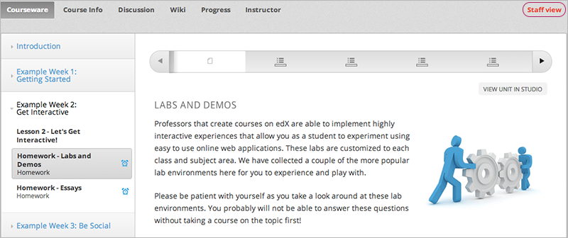
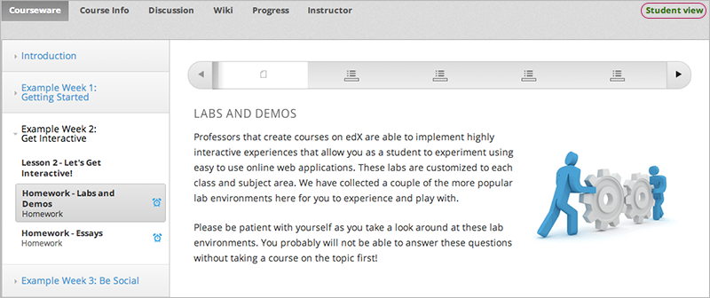

.. _Testing Your Course Content:

###########################
Testing Your Course Content
###########################

The way your course looks in Studio is not the way that students will see and
experience it when it is live. To test the content that you add when you are
building your course, you can view and interact with your course from a
student's point of view.

You can:

* :ref:`Preview Course Content`
* :ref:`View Your Live Course`

For information about setting up a beta test for your course, see
:ref:`Beta_Testing`.

.. _Preview Course Content:

*************************
Preview Course Content
*************************

You preview course content before you publish it to test how it will look to
students.
 
When you preview your course, you see the latest course content as configured
in Studio. You see content in units in the state
:ref:`Draft (Never Published)`, :ref:`Draft (Unpublished Changes)`, or
:ref:`Unpublished (Staff Only)` while students can see only the last
published version of a unit in the live course.

For example, you publish a unit with a video and discussion:

IMAGE OF UNIT PAGE IN STUDIO

Students see the same content in the LMS:

IMAGE OF UNIT IN LMS

You then decide to add a multiple choice question to the unit, but you do not
yet publish the changes.

IMAGE OF DRAFT UNIT - With PREVIEW button circled

When you click **Preview Changes**,  you see the unit in the LMS with
the multiple choice question:

IMAGE OF PREVIEWED UNIT

This preview shows how students will experience the unit after you
:ref:`publish the change<Publish a Unit>`.

In the live course, students continue to see the same content, without the
multiple choice question, until you :ref:`publish the change<Publish a Unit>`.

.. note:: 
  **Preview Changes** in not available when the unit's state is
  :ref:`Published`, because in this case the preview and live version are
  exactly the same. You can view the live course to see the published content.

 
.. _View Your Live Course:

******************************************
View Your Live Course
******************************************

You can view your course in the LMS, as a student sees it, directly from
Studio. You can see your course in `Staff View`_ or `Student View`_

While you work in Studio, you can switch to your live course to see how your
course appears to students in two ways.

* From the outline page, click **View Live**.
   
   ADD IMAGE

* In a unit page, click **View Live**.
   
   ADD IMAGE 

=================
Staff View
=================

When you log in as a course team member, you see see the course in the **Staff
View**.

     at top right and a View Unit in Studio button

When you view your course in **Staff View**, you can execute tests to make
sure that your course works the way you intend. For example, members of the
course team can work through the problems to verify that the correct answer
gets a green check for correct, and that any answer other than the correct one
gets a red X for incorrect.
 
In **Staff View**:

* You see all units in the state :ref:`Published`. For units in the state
  :ref:`Draft (Unpublished Changes)` or :ref:`Unpublished (Staff Only)`, you
  see the last published version of the unit. You see these units
  regardless of the release dates of the containing section or subsection.

* You do not see units that are in the state :ref:`Draft (Never Published)`. To
  see these units, you must use Preview mode as described in :ref:`Preview
  Course Content`.

* You can access the Instructor Dashboard, which has features and reports that
  help you run your course.

=================
Student View
=================

When viewing your course in the LMS, you can switch to student view, to see the
content exactly how students will see it.

To switch from **Staff View** to **Student View** and back again, click **Staff
View** or **Student View** in the upper right corner.

     indicated at top right

In **Student View**:

* You do not see units in sections or subsections that have not yet been
  released.

* If the section and subsection are released, you see units in the state
  :ref:`Published`. For units in the state
  :ref:`Draft (Unpublished Changes)`, you see the last published version of the
  unit. 

* You do not see units that are in the state :ref:`Draft (Never Published)` or
  :ref:`Unpublished (Staff Only)`. To see these units, you must use Preview
  mode as described in :ref:`Preview Course Content`.

* You can access the Instructor Dashboard, which has features and reports that
  help you run your course.

*************************************
Open Studio from Your Live Course
*************************************

When you are viewing your course as **Staff View**, you can open Studio
directly.
 
* In a unit page, click **View Unit in Studio**.
  
  .. image:: ../Images/Live_Studio_from_LMS_Unit.png
   :alt: The View Unit in Studio button in an LMS unit
 
* In the Instructor Dashboard, click **View Course in Studio** to open the
  course outline.
 
  .. image:: ../Images/Live_Course_Instructor_Dashboard.png
    :alt: Image of the Instructor Dashboard in a live course with a View Course
        in Studio button

  For information about the tasks you can complete on the Instructor Dashboard,
  see :ref:`Running Your Course Index`.
 
* In the **Course Progress** page, click **View Grading in Studio** to open the
  Grading page.
 
  .. image:: ../Images/Student_Progress.png
     :alt: Image of the Course Progress page for a student with a View  Grading
         in Studio button

  For information about checking a student's progress, see
  :ref:`Review_grades`.