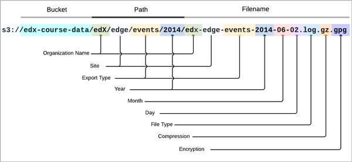

.. _Package:

######################################

######################################

#. Access Amazon S3 and navigate to the edX **course-data** bucket. For each
   period that a data package is prepared for your organization, two files are
   available.

   Event tracking data is in a file named {date}-{organization}-tracking.tar.
   Database data files are in a file named {organization}-{date}.zip.

************
Introduction
************

EdX provides two types of research data to partners who are running classes on edx.org and edge.edx.org:

    Log (event tracking) data
    Database data, including student information

To access log and database data packages, you download files from edX, then extract the information from those files for analysis, as described in :ref:`Decrypt an Encrypted File`.

************************
Event Tracking Data
************************

The edX platform gathers tracking information on almost every interaction of
every student. For details about collected information, see :ref:`Tracking
Logs`.

:alt: The AWS bucket, AWS directory hierarchy, and the components of the event file namewith color-coded call-outs

Event tracking data for your institution is collected in a file named: Date-Institution-tracking.tar. 

For example:  2013-10-27-UniversityA-tracking.tar

When you extract the contents of this TAR file, sub-directories are created for each edX server that the course is running on.  For example, you may see the following sub-directories:

    prod-edxapp-003
    prod-edxapp-004
    prod-edxapp-005

Each of these sub-directories contains a file of tracking data for each day. The TAR file is cumulative; that is, it contains files for all previous days your course was running on that server.

The filename format for event tracking data files is: Date_Institution.log.gpg.

For example: 2013-10-22_UniversityA.log.gpg.

You must decrypt these files. See :ref:`Decrypt an Encrypted File`.

Note: Because a course runs on multiple servers, during analysis you must combine events from each server to get a complete picture of course activity.

************************
Database Data
************************

Database data files are collected in a ZIP file named:  Institution-Date.zip

For example: UniversityA-2013-10-27.zip

When you extract the contents of this ZIP file, files are placed in the same directory as the ZIP file. 

The filename format of extracted files is: institution-course-date-data_type-server-analytics.sql.gpg

For example: UniversityA-Physics101-2013_user_id_map-prod-analytics.sql.gpg

You must decrypt these files. See :ref:`Decrypt an Encrypted File`.

AWS bucket

====================
Database Data Files
====================

The data files are views on database tables used by the edX Learning Management System.

The following table describes the types of data files that edX delivers.
Type	Filename Format	Description	
Authorized Users	Institution-Course-Date-auth_user-Server-analytics.sql.gpg	Information about users authorized to access the course. See the auth_user table

Authorized User Profiles	Institution-Course-Date-auth_userprofile-Server-analytics.sql.gpg	Information about student demographics.	auth_userprofile table

Generated Certificates	Institution-Course-Date-certificates_generatedcertificate-Server-analytics.sql.gpg	Certificate status for graded students after course completion.	certificates_generatedcertificates table

Courseware	Institution-Course-Date-courseware_studentmodule-Server-analytics.sql.gpg	Information about courseware state for each student. There is a separate row for each (UNIT?) the course. For courses that do not have any records in this table no file is produced.	courseware_studentmodule table

Forums	Institution-Course-Date-Server.mongo.gpg	Course discussion forum data.	Discussion forum data

Course Enrollment	Institution-Course-Date-student_courseenrollment-Server-analytics.sql.gpg	Information about students enrolled in the course, enrollment status, and type of enrollment.	student_courseenrollment table

User IDs	Institution-Course-Date-user_id_map-Server-analytics.sql.gpg	A mapping of user IDs and obfuscated IDs used in surveys.	user_id_map table

Wiki articles	Institution-Course-Date-wiki_article-Server-analytics.sql.gpg	Course wiki data.	Wiki data

